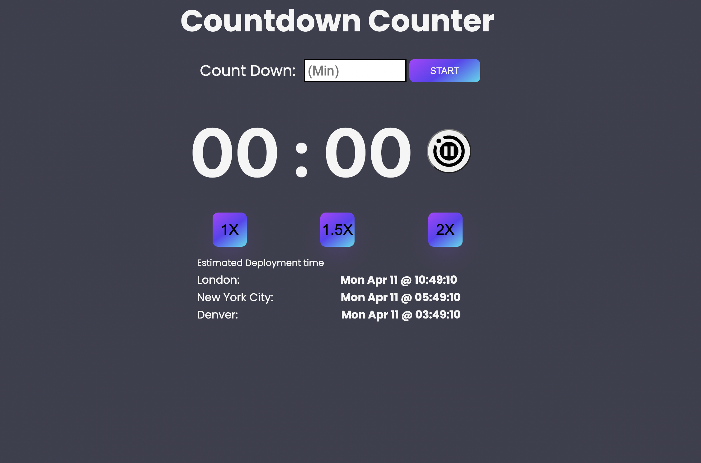
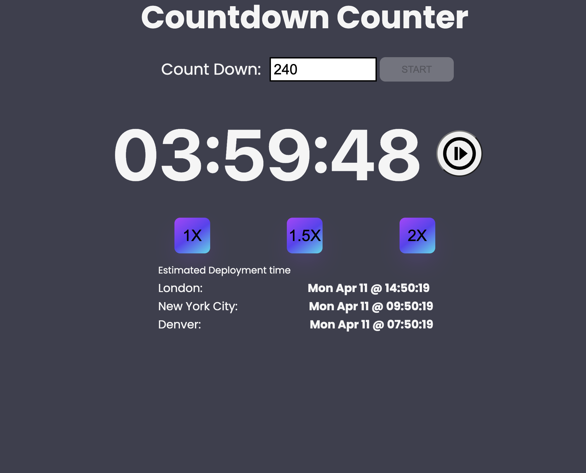
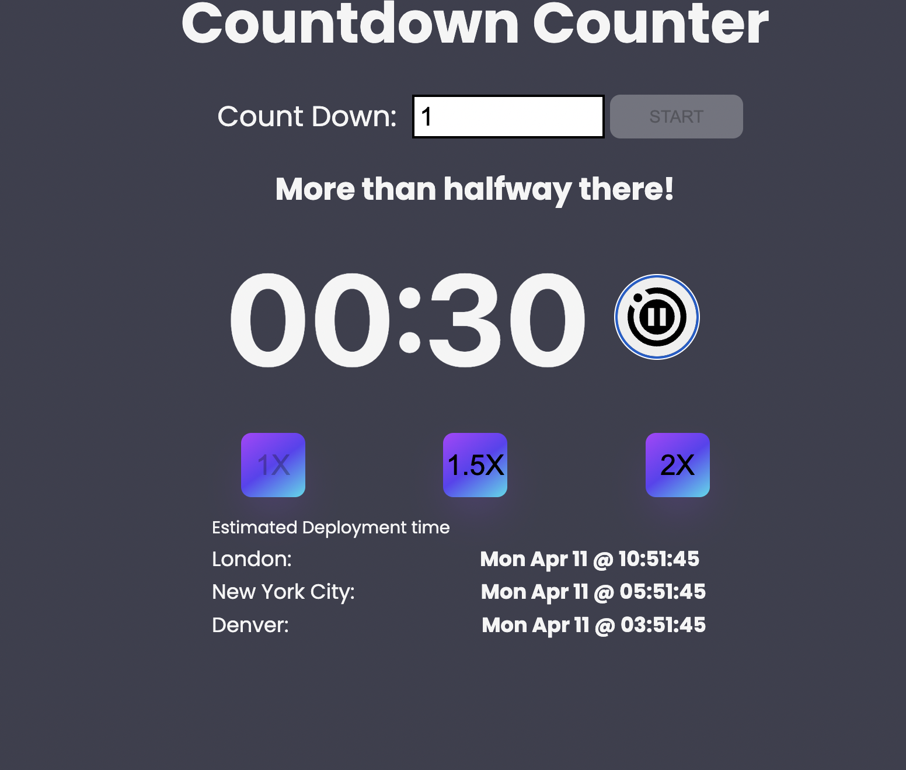
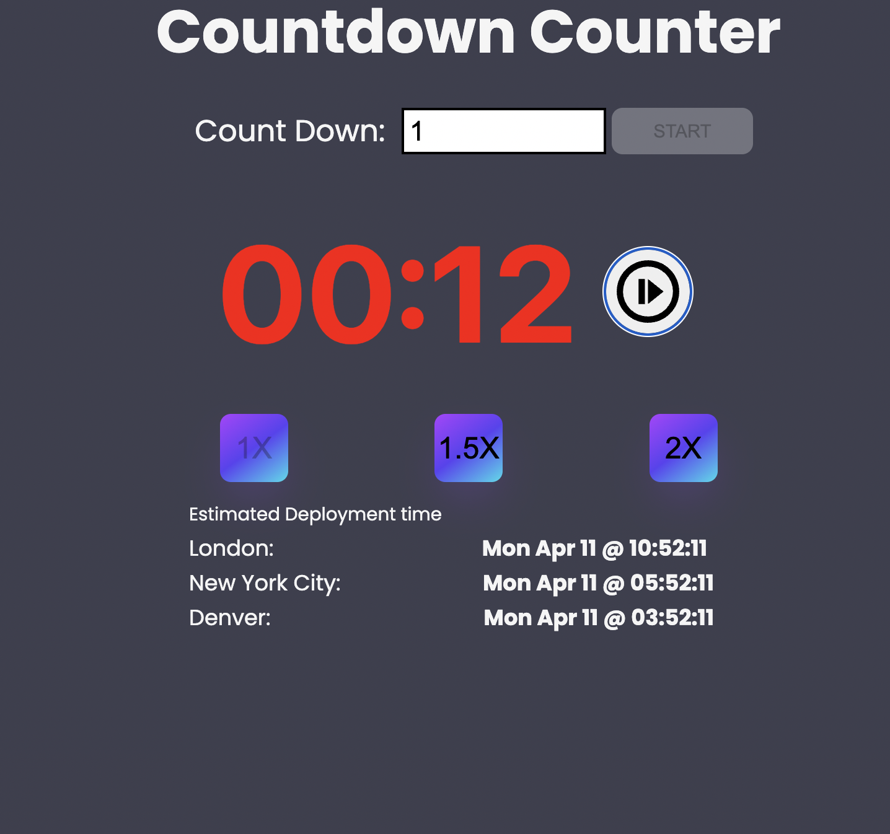
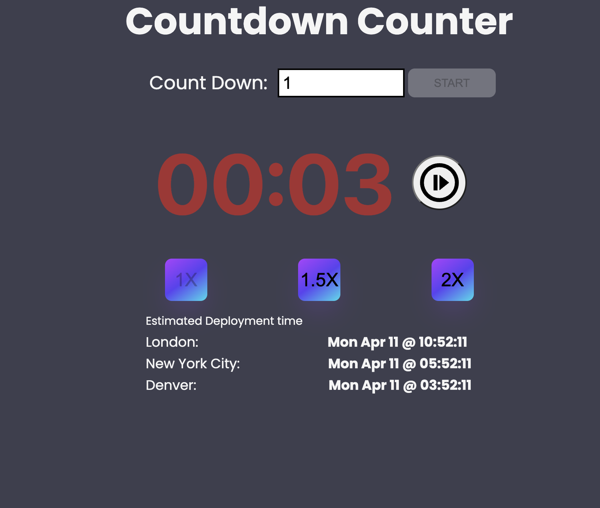
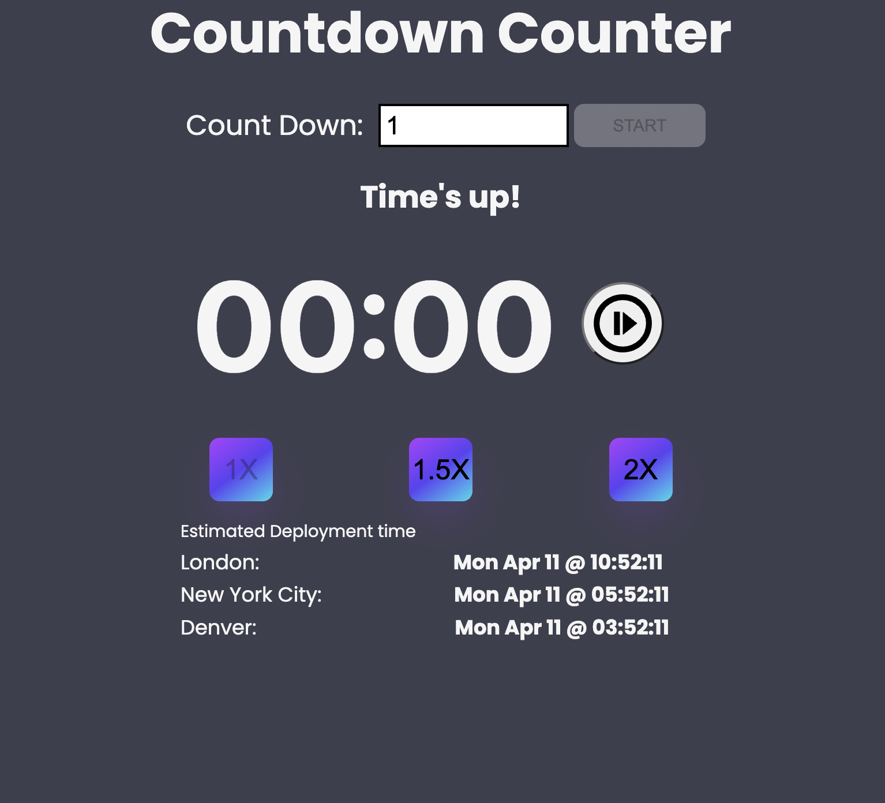

## Countdown

## Intro 
Build a dynamic counter that will countdown from an entered input in minutes and without the any 3rd party library for time or styling. Display a estimated deployment date and time in 3 different timezones.
The countdown timer should have controls that add time, speed up / slow down the countdown, pause, and resume. Sometimes the counter will be started more than 1 day in advance, so it should also display the local time for each office when the countdown will reach 00:00.

## USER story
A Tech company wants to put countdown timers on TVs in their offices to celebrate estimated milestone deployments when they go out and help make sure everyone in the office knows when the deployment is released. A member from each office (London, New York and Denver) will synchronize and start the timer at the same time. They also want to be able to speed up the timer and pause it if needed.

### Initial Page

### I added four hours to the counter, notice the deployed time change for the timezones

### At the halfway point a message pops up "More than halfway there"

### At the last 20 seconds: The counter numbers turn red

### At the last 10 seconds: The counter numbers remain red and start flashing

### When the timer is finished a "Time's up!" message appears
